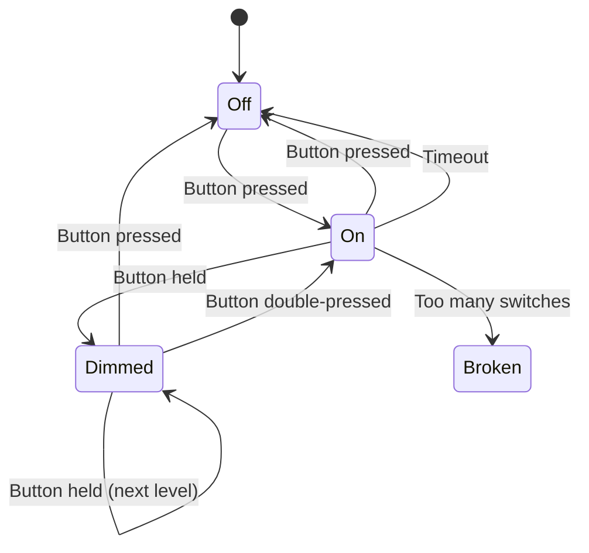

# Example state machine

A lamp with a button, a dimmer and an auto-off timer.

```mermaid
stateDiagram-v2
    [*] --> Off

    Off --> On : Button pressed
    On --> Off : Button pressed
    On --> Off : Timeout
    On --> Dimmed : Button held
    Dimmed --> Dimmed : Button held (next level)
    Dimmed --> Off : Button pressed
    Dimmed --> On : Button double-pressed
    On --> Broken : Too many switches
```